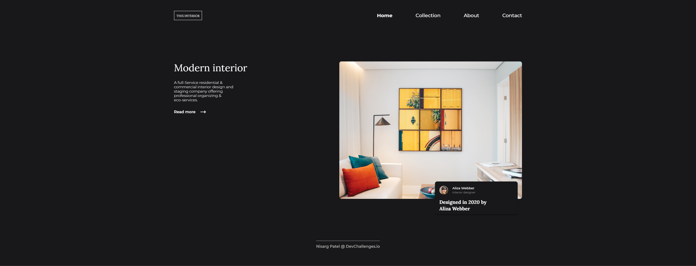

<!-- Please update value in the {}  -->

<h1 align="center">Dev Challenges - Responsive Path - Challenge 3 : Interior Consultant</h1>

   Solution for a challenge from  <a href="http://devchallenges.io" target="_blank">Devchallenges.io</a>.

  <h3>
    <a href="https://devchallenge-interior-consultant.netlify.app">
      Demo
    </a>
     | 
    <a href="https://github.com/nisargp08/DC-P1-R-Interior-Consultant/blob/master/src/App.vue">
      Solution
    </a>
     | 
    <a href="https://devchallenges.io/challenges/Jymh2b2FyebRTUljkNcb">
      Challenge
    </a>
  </h3>

<!-- TABLE OF CONTENTS -->

## Table of Contents

- [Overview](#overview)
  - [Built With](#built-with)
- [Features](#features)
- [Contact](#contact)

<!-- OVERVIEW -->

## Overview

Introduce your projects by taking a screenshot or a gif. Try to tell visitors a story about your project by answering:

### Built With

<!-- This section should list any major frameworks that you built your project using. Here are a few examples.-->
- [Vue.js](https://vuejs.org/)
- [Tailwind](https://tailwindcss.com/)

## Features

<!-- List the features of your application or follow the template. Don't share the figma file here :) -->

This application/site was created as a submission to a [DevChallenges](https://devchallenges.io/challenges) challenge. The [challenge](https://devchallenges.io/challenges/Jymh2b2FyebRTUljkNcb) was to build an application to complete the given user stories.

## Contact

- GitHub [@nisargp08](https://github.com/nisargp08)
